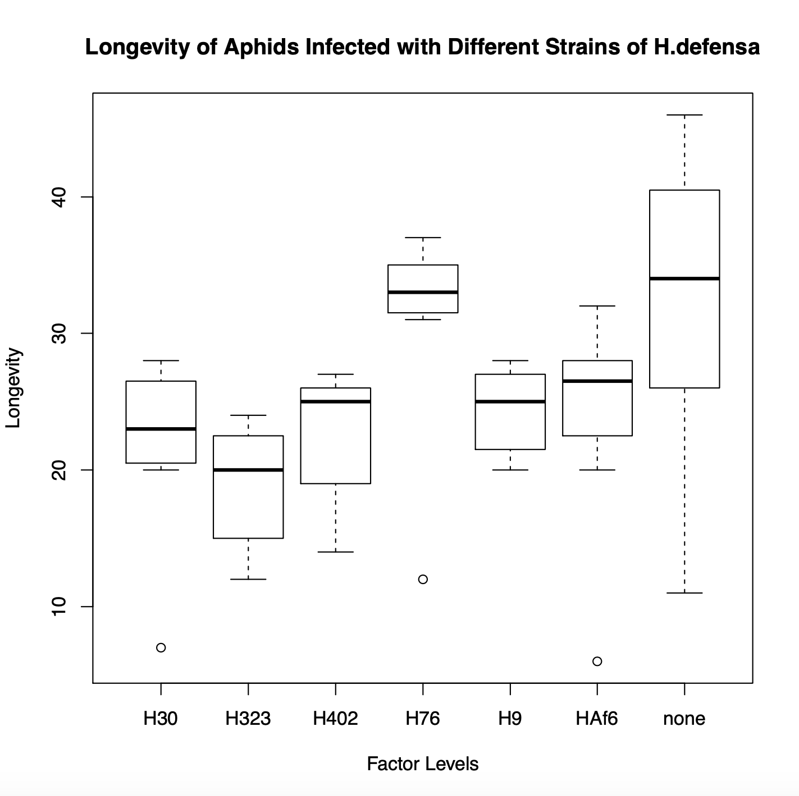
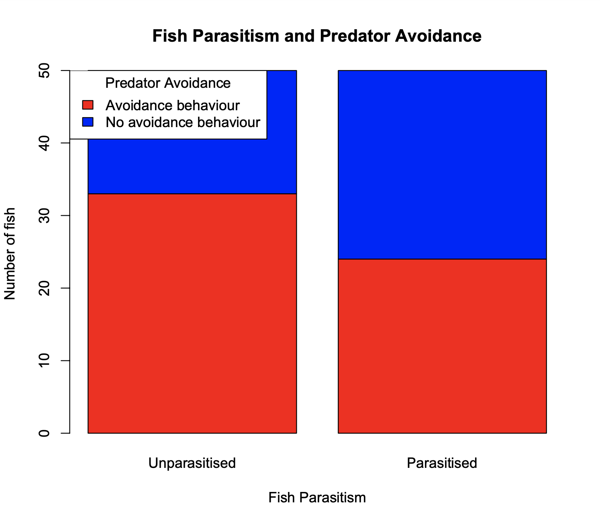
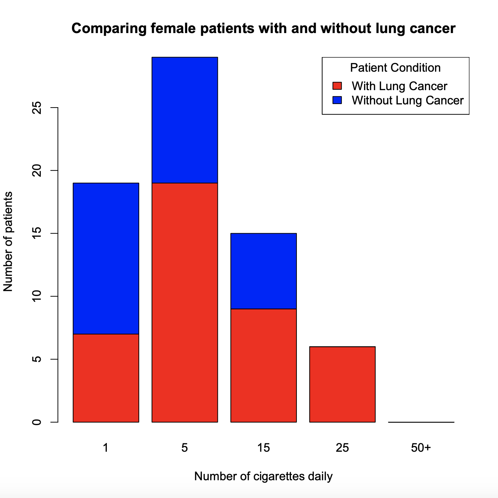

# A Bit Of R

>  Introductory biodata analysis and visualisation. 🦠

**Work in Progress.**

*A Bit Of R* holds my first steps in biodata analysis and visualisation using R.

*Disclaimer: Although the aim of this repository is to learn a bit of R, the example data used are real.*

## Table of contents
- [Contents](#contents)
	- [Aphid Longevity](#aphids)
	- [Comparing Means](#means)
    - [Fish Parasitism and Predatory Behaviour](#fish)
    - [Smoking Rates and Lung Cancer Occurence in Female Patients](#smokingRatesandLungCancerFem)
- [Installation Guide](#installation)
- [How To Contribute](#contributions)
- [Resources](#resources)
- [Authors](#authors)
- [LICENSE](#license)

<a name="contents"/>

## Contents
<a name="aphids"/>

### Aphid Longevity


<a name="means"/>

### Comparing Means

<a name="fish"/>

### Fish Parasitism and Predatory Behaviour


<a name="smokingRatesandLungCancerFem"/>

### Smoking Rates and Lung Cancer Occurence in Female Patients


<a name="installation"/>

## Installation Guide

1. Clone or download the repository.
2. Execute .r file.
    ```
    Rscript example.r
    ```
*R must be installed on your system before Rscript can be run.*

<a name="contributions"/>

## How To Contribute

Contributions are what make the open source community an amazing place to be, learn and grow. Any contributions to **README.md** are **greatly appreciated**.

1. Fork the project.
2. Create a Branch:
	```
	git checkout -b <name>
	```
3. Commit your changes and push to the branch:
	```
	git commit -m "commit-name"
	git push
	```

5. Open a Pull Request.

<a name="resources"/>

## Resources

- [R Documentation](https://www.rdocumentation.org/)
- [Introduction to R](https://www.datamentor.io/r-programming/)

<a name="authors"/>

## Authors

[cortesana](https://twitter.com/cortesana_dev)

<a name="license"/>

## LICENSE

**MIT License**
